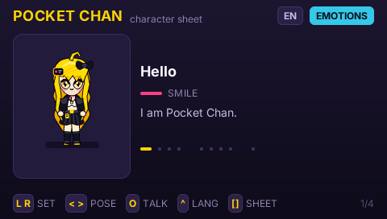

# Pocket Chan

The PocketJS mascot's character sheet, running on a 480x272 PSP. Nine baked
clips, a card that names the pose and gives her a line, and every string in
**English, Japanese and Chinese**.



## Controls

| Button | Action |
| --- | --- |
| D-pad left / right | previous / next pose in the current set |
| D-pad up / down, L / R | previous / next set (Emotions, Actions, Turnaround) |
| Circle | next line from the selected pose |
| Triangle | English -> 日本語 -> 中文 |
| Square | palette and build sheet |
| Cross | close the sheet |

## How a pose animates

`tools/pocket-chan/bake.py` writes one 512x256 RGBA atlas per clip: eight
128x128 cells in a 4x2 grid, listed in `sprites.json` with the vblanks each
cell holds. `tools/build.ts` bakes each atlas into the pak as a
`ui:sprite.<file>` entry at PSM_4444, which halves its texture memory.

`<Sprite sprite={pose().sprite}>` binds one atlas. **The core picks the cell
from its own vblank counter** (`engine/core/src/draw.rs`), so a running pose
costs no JavaScript per frame and switching pose is a single prop write that
rebinds the texture and restarts the loop.

Nothing reaches the edge of its 128px cell. The atlas has no gutter between
cells, so ink at the border would sample into the neighbouring frame;
`bake.py` refuses to write an atlas that comes within a pixel of the edge and
`tests/pocket-chan.test.ts` re-checks the shipped PNGs.

## Text in three languages

Inter carries the Latin; `chan-cjk.otf` is a 235-glyph subset of Noto Sans CJK
JP that carries the kana and Han. `fonts.json` names it as the fallback face,
and `framework/compiler/bake-font.ts` reaches for it per character whenever the
primary face has no glyph.

**The baker puts every collected codepoint in every font slot the styles use**,
so each additional text size costs another copy of all 235 CJK glyphs. This
screen spends five slots (12, 14 and 16 px regular, 12 px bold, 18 px bold) for
468 KB of glyph coverage; adding a sixth size is a ~100 KB decision, not a
styling one.

The subset is generated from these sources. Editing a Japanese or Chinese
string without regenerating it ships a tofu box rather than an error, so
`tests/pocket-chan.test.ts` fails when a character on the sheet is missing from
the face. Regenerate with the command in `tools/pocket-chan/README.md`.

One face serves both languages: Noto Sans CJK JP covers the Han this sheet
uses, drawn with Japanese regional glyph shapes. A handful of characters
therefore differ from their Simplified Chinese form.

## Build and run

```sh
bun tools/build.ts apps/pocket-chan/main.tsx --framework=solid   # pak + bundle
bun tools/psp.ts pocket-chan --release                            # EBOOT + PRX
bun psplink                                                       # pick it on a real PSP
bun tools/pocket-chan/shots.ts                                    # PPSSPP frame captures
```

The pak is 2.83 MB: 2.36 MB of sprite atlases, 468 KB of glyph coverage, and
the style table.
