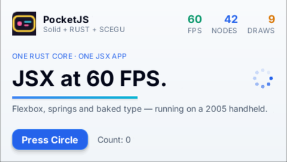

# Wii renderer fixture

This static `wii-dev` ABI 7 guest exercises **rectangles, nested clipping, transformed alpha images, baked glyphs, and Wii Remote A input**. Its first frame is deterministic; pressing A changes only the indicator.

## Build and package

From the repository root, with the devkitPPC environment configured as in [`hosts/wii/README.md`](../../README.md):

```sh
bun tools/wii.ts w25-renderer-fixture
make -C hosts/wii/core/admission-check desktop \
  SOURCE="$PWD/dist/wii/guest/w25-renderer-fixture.pocket" \
  WORK="${TMPDIR:-/tmp}/pocketjs-w25-admission"
make -B -C hosts/wii/example \
  GUEST_PACKAGE="$PWD/dist/wii/guest/w25-renderer-fixture.pocket" V=1
```

The guest package is `dist/wii/guest/w25-renderer-fixture.pocket`. The example emits `hosts/wii/example/build/boot.dol`; it draws the **480×272 logical surface** at `(80,80)` in the 640×480 EFB for this check.

## Capture and normalize

The checked-in captures were made in Dolphin with Vulkan. To repeat the check, capture the full 640×480 EFB once before input and once after pressing Wii Remote A, then run the checker:

```sh
bun hosts/wii/check/w25/check.ts hosts/wii/check/w25/evidence/before-a.png
bun hosts/wii/check/w25/check.ts hosts/wii/check/w25/evidence/after-a.png --cross
```

The checker accepts a 640×480 EFB capture directly. If a window capture includes scaling or surrounding UI, pass the full EFB rectangle with `--crop=x,y,width,height`; **do not pass a guest-only crop**.

Both normalized captures passed all 10 samples. All flat-color samples matched exactly. The glyph sample was `#fbfbfb` against white within ±8; the alpha formula predicts `#400060`, while the captured sample is `#41005f` (red +1, blue −1; allowed ±4 per channel). Before input, the indicator is `#c02020`; after one Wii Remote A press it is `#20c060`.

| Sample | Guest coordinate | Expected RGB | Operation |
| --- | ---: | --- | --- |
| Outer rect | `(32,116)` | `#204060` | Rect; active outer clip |
| Hidden overflow | `(52,140)` | `#204060` | Nested clip blocks red child |
| Red child | `(64,134)` | `#e03020` | Inner clip and painter order |
| Inner fill | `(110,164)` | `#406020` | Nested rect |
| Sibling after inner clip | `(140,145)` | `#f0b020` | Clip pop restores outer clip |
| Beyond outer clip | `(156,145)` | `#202830` | Outer clip remains active |
| Image origin | `(198,64)` | `#000080` | Translated/scaled image boundary |
| Transformed alpha image | `(238,64)` | about `#400060` (±4/channel) | Scale, texture alpha 128, node opacity 0.5 |
| Baked glyph | `(25,22)` | white (±8/channel) | Text rasterization |
| Input indicator | `(376,84)` | `#c02020` before; `#20c060` after A | `BTN.CROSS` input |

The alpha texture is a uniform 2×2 RGBA image, so the sample is away from its edge. The glyph sample is a bright interior pixel of the white `W25 RENDER CHECK` label.

| Before A | After Wii Remote A |
| --- | --- |
|  |  |

## Live hero capture

The separate hero capture below shows the **480×272 logical surface** at a live frame. It does not replay the Web golden input tape, so the count, spinner phase, and underline position differ.


