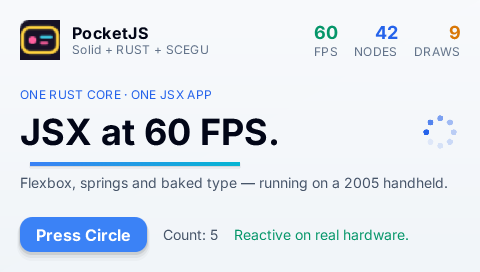
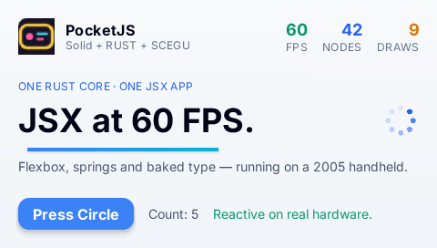

# Pocket Micro — design

**Pocket Micro** compiles a PocketJS Solid application to native code. The
input is the component module the QuickJS host runs today; the output is one
Rust module that drives `pocketjs-core` through typed calls and links into a
PSP EBOOT with **no JavaScript engine**. The proof target is `apps/hero`:
`apps/hero/main.tsx` and `apps/hero/app.tsx` compile unchanged, render
**byte-identical frames** to stock Solid under the shared core, and run on
PSP hardware over PSPLINK.

## 1. Position

Three Pocket compilers now exist, one per boundary:

| | input | output | app logic |
|---|---|---|---|
| Pocket Vapor (`vapor/`) | Vue Vapor TS subset | C against `vapor/runtime` | compiled: refs, computeds, keymaps, helpers |
| Vue/Solid AOT (#428) | Vue SFC / Solid TSX templates | Rust against `pocket_vapor` over `pocketjs-core` | supplied as a Rust view-model trait implementation |
| Pocket Micro (`micro/`) | Solid component module in Micro TS | Rust against `pocket-micro` over `pocketjs-core` | compiled: signals, effects, hooks, handlers, refs, animation |

Vapor targets machines with no core at all and owns its cell-grid runtime.
#428 keeps the retained core and compiles templates, with the model written
in Rust. Pocket Micro keeps the retained core and compiles the **whole
module**, so an existing PocketJS app moves from the QuickJS guest to native
code without a per-app Rust file. The runtime it links (`engine/crates/
pocket-micro`) is what the Solid runtime did in JS: the two root layers
`render()` creates, the document-order focus list, CIRCLE press dispatch with
the `active:` variant, texture and sprite lookup by name, JS number
formatting.

## 2. Micro TS

Micro TS is the part of TypeScript + Solid + `@pocketjs/framework` with a
static shape. Membership has the same operational definition as Pocket
Vapor's subset: **a Micro TS module runs unmodified under real Solid on a JS
host**, and the parity test drives both with one tape. The compiler enforces
the subset with `file:line:column` diagnostics.

In:

- `createSignal(seed)` for a number, boolean or string seed; `count()`
  reads; `setCount(v)` and `setCount(prev => v)` writes.
- `createEffect(() => {...})`, `onMount(() => {...})`, `onCleanup` (a no-op:
  the root never unmounts).
- `let x: NodeMirror | undefined` ref slots bound by `ref={x}` /
  `nodeRef={(n) => { x = n }}`; `animate`, `spring`, `jump` from
  `@pocketjs/framework/animation` on a bound ref.
- Setup-level `const` values without signal reads, `const f = () => ...`
  and `function f()` helpers inlined at their calls.
- Components: module-level functions taking one props object, **inlined at
  every use site** with the use-site expressions substituted for `props.x`.
  Callback props inline the caller's arrow; absent optional callbacks
  (`props.onAction?.(n)`) fold to nothing; JSX children props splice.
- JSX over `View`, `Text`, `Image`, `Sprite` and `<Show when>` /
  `cond ? <A/> : null` / `cond && <A/>`. `class` is a literal or a ternary
  of literals; `style` is an object of numeric expressions or color
  literals; `focusable`, `onPress`, `debugName`, `src`, `sprite`,
  `frameStep`.
- Expressions: literals, template literals, `String(x)`, arithmetic,
  comparison, `&&`/`||`/`!`/`??`, ternaries, `Math.floor/ceil/round/trunc/
  abs/min/max`, `frameworkName()`, `TICKS_PER_SECOND`.
- Statements in handler/effect/hook bodies: `const`/`let`, assignment and
  compound assignment to locals, `if`/`else`, early `return`, setter calls,
  animation calls, inlined helper and callback calls.

Out (diagnostics): dynamic property access and indexing, arrays and
`<For>`, objects other than `style` and animate options, closures as
values, `any`, exceptions, async, classes, `createMemo`/`createResource`,
transitions, setup-level signal reads (`const twice = count() * 2` reads
once and is not reactive), class strings built from fragments, two
conditional blocks with no static sibling between them, child components in
other modules (v1).

Numbers: a numeric expression is `int` (i32) or `num` (f64). Literals
without a fraction are `int`; `+ - * %` of two ints stay `int`; `/` and any
`num` operand make `num`. A signal's type is the join of its seed and every
write site, computed to a fixpoint, so `setX(x() / 2)` widens `x` to `num`
everywhere. `int` arithmetic wraps at 32 bits; `String(x)` follows
ECMAScript Number::toString, including the exponent forms below 1e-6 and
from 1e21.

## 3. Compile-time model

What a JS runtime resolves per frame, the frontend resolves once:

- **Props have no runtime existence.** The entry's `mount(() => <Hero />)`
  gives the root props (none for hero); every `props.largeLayout ? a : b`
  folds to `b`, every `props.headline ?? "…"` folds to its default, and
  `Stat` inlines three times with `label`/`value`/`cls` substituted. The 12
  `largeLayout` class variants leave the program and the style table.
- **Every binding has a static dependency set.** Text runs, style values,
  class ternaries, `Show` conditions and effect bodies record the signal ids
  they read. Conditional reads subscribe both arms (Vapor's
  over-approximation: a redundant re-apply, never a missed one).
- **Text runs concatenate at compile time.** `Count: {count()}` is one run
  `concat("Count: ", tostr(count))` on the `<Text>` element itself. The core
  lays out a text element over the concatenation of its own text and its
  text children (`Tree::collect_run`), so one `set_text` on the element and
  Solid's two child text nodes produce the same run.
- **Elements are numbered in template pre-order.** The index is the
  element's `NodeId` slot in the generated struct and its focus-traversal
  key, so a conditional block registers its focusables at fixed positions
  without a tree walk. `onPress` bubbling is resolved statically: each
  focusable carries the handler of itself or its nearest ancestor.
- **Conditional blocks anchor on their next static sibling** (`insert_before`
  with that element, or append). Empty text markers are not needed.

## 4. Micro IR

The IR is JSON data typed in `micro/compiler/ir.ts`; `bun micro/compiler/
cli.ts ir hero` prints it. TypeScript types plus a JSON form were chosen over
a Rust or binary IR because the frontend already lives on the TypeScript compiler
API (the same choice Vapor and #428 made), the IR is inspected and asserted
in `bun test`, and a second backend, say a C emitter for a Vapor-class
console, consumes the same structure.

```
Program   title, entry, module, component
          signals[]   { id, name, ty: int|num|bool|str, init }
          refs[]      { name, element }
          effects[]   { id, deps: signal ids, body: Stmt[] }
          mounts[]    { id, body }
          handlers[]  { id, element, body }
          setupOrder  effects and mounts in declaration order
          root        Node[]
          focusables  root-level { element, order, handler? }
          assets      { classes, strings, images, sprites }
Node      element { id, tag, order, class?: Binding, style?: [{prop, value: Binding}],
                    text?: Binding, src?, sprite?, focusable?, handler?, refs?, children }
          show    { id, when: Binding, anchor: element id | null, focusables, children }
Binding   { expr, deps }
Expr      int | num | bool | str | undef | signal | local | noderef | unary | binary |
          cond | truthy | concat | tostr | call(builtin)      — every node carries its type
Stmt      let | assign | set(signal) | if | animate | jump | return | nop(note)
```

## 5. Runtime: `pocket-micro`

`engine/crates/pocket-micro` is `#![no_std]` + alloc over `pocketjs-core`
and links into both the PSP EBOOT and the desktop harness.

- `Runtime::new(ui, assets)` creates the app layer (`480×272`, overflow
  hidden) and the overlay layer (absolute, `zIndex 1000`, `hitPass`) with
  the same props `framework/src/index.ts` `render()` sets, so layout and
  paint order match the JS runtime.
- `trait App { mount, press, flush, state }` is what generated code
  implements. `mount` builds the static tree, applies initial bindings,
  registers focusables, then runs effects and mount hooks in declaration
  order — Solid runs both as effects after render, in creation order.
- `Runtime::frame(app, buttons)` is `framework/src/input.ts` `handleFrame`
  for the classic model: edge detection, DOWN/RIGHT next and UP/LEFT
  previous over the sorted focus list (enter from the direction's end,
  clamp at the ends), CIRCLE sets `active:` on the focused node and calls
  its handler, release clears `active:`. Then `app.flush`.
- **Flush** takes the dirty word, re-applies every binding whose mask
  intersects it (template pre-order), then re-runs effects that read a
  written signal, and repeats until a pass writes nothing (bounded at 32).
  Setters compare before marking dirty (Solid's `===` gate). Observable
  state at the frame boundary equals Solid's synchronous propagation.
- Text runs re-apply through a scratch `String` compared to the previous
  run; style values compare as `f64`; class ternaries compare style ids.
- `fmt` is JS Number::toString and `Math` helpers in `core` (the PSP target
  has no std float math; floor/ceil/round/trunc go through `i64`).
- `pak::feed` is the platform-neutral `.pak` walker (styles, atlases,
  images, sprite atlases) with a callback the PSP host uses for the GE
  writeback.

## 6. Generated code

For hero the module is **265 lines**: one `i32` signal, a 31-entry
`NodeId` table, one conditional block flag, one text cache, one style
cache and a `u64` dirty word.

```rust
fn set_s0(&mut self, v: i32) { if v != self.s0 { self.s0 = v; self.dirty |= 0x1u64; } }
fn text_29(&self, out: &mut String) { out.push_str("Count: "); fmt::push_int(out, self.s0); }
fn apply_style_22_translateX(&mut self, rt: &mut Runtime) {
    let v: f64 = (self.s0.wrapping_mul(2i32) as f64);
    if v != self.p22_translateX { self.p22_translateX = v; rt.set_prop(self.n[22], prop::TRANSLATE_X, v); }
}
fn apply_show0(&mut self, rt: &mut Runtime) {
    let on = (self.s0 > 3i32);
    if on != self.show0 { if on { self.mount_show0(rt); } else { self.unmount_show0(rt); } }
}
fn handler_0(&mut self, rt: &mut Runtime) { self.set_s0(self.s0.wrapping_add(1i32)); }
fn mount_0(&mut self, rt: &mut Runtime) { rt.animate(self.n[22], prop::WIDTH, (210i32 as f64), 700u32, 2u8, 150u32); }
```

`flush` for hero is four masked applies plus the effect, all on `0x1`.

## 7. Pipeline

```
apps/hero/main.tsx + app.tsx
   │ micro/compiler/frontend.ts   subset check, prop folding, component inlining,
   │                              signal numbering, int/num fixpoint, template lowering
   ▼
Micro IR
   ├─ micro/compiler/emit-rust.ts  → dist/micro/hero/app.rs
   └─ micro/compiler/assets.ts     → dist/micro/hero/hero.pak      (styles.bin, atlases, images, sprites;
                                                                    framework/compiler tailwind + bake-font + pak)
   ▼
hosts/psp-micro (cargo psp)        → pocket-micro-psp.prx / EBOOT.PBP
micro/harness (cargo)              → frame dumps for parity
```

**Nothing generated is committed.** `app.rs`, the IR, the pak, `styles.bin`
and the manifest are pure functions of the app sources and this compiler, so
they are built on demand into ignored `dist/micro/<app>/`; `hosts/psp-micro/
build.rs` takes their paths through `POCKET_MICRO_APP_RS` and
`POCKET_MICRO_PAK`. A checked-in copy would be a second source of truth that
review has to diff and CI has to re-verify, and it would put machine output
in the app's source directory. What guards the emitter instead is the parity
test, which compiles its output and compares pixels, plus emitter assertions
in `micro/tests/compiler.test.ts`. The build identity in every device receipt
is the sha256 of the compiled module and its pak, so a stale binary on the
device announces itself.

`bun micro/compiler/cli.ts build hero --psp --release --tape "<frame:mask,…>"`
bakes a button tape (the capture-build format) so a device run replays the
golden interaction without a human; the pad takes over when the tape ends.
The EBOOT writes a JSON receipt to `host0:/pocket-micro-receipt.txt` at frame
240: build identity, per-stage microseconds, arena use, the app's signal
state and the focused node. `micro/scripts/psplink.ts` loads the PRX over
PSPLINK, takes a `scrshot`, and collects the receipt.

`hosts/psp` gained a `quickjs` cargo feature (default on). With it off the
crate is the PSP substrate a compiled app links — arena allocator, graphics
init, worker thread, GE backend — and `libquickjs-sys` is not compiled.
`hosts/psp-micro` depends on it that way; the stock `pocketjs-psp` EBOOT
still builds with the default feature set.

## 8. Validation

**Pixel parity.** `bun micro/tests/parity.ts hero` builds the stock Solid
bundle, runs it under the wasm core with the hero golden tape from
`tests/golden-specs.ts` (DOWN at frame 5, CIRCLE at 20/24/28/32/36), and
compares the harness's software-rasterized frames at 2, 10 and 80 with the
oracle's PNGs. Result: **all three frames byte-identical**; final state
`{"count":5}`, focused node 31, zero unknown textures or sprites. The
committed `tests/goldens/web/hero-main.*.png` differ from both in the
40×40 logo region: they predate the logo rebrand (#346) and are not
touched by this change.

**Hardware.** Same tape on a PSP over PSPLINK (`micro/scripts/psplink.ts`),
release builds, 333 MHz, 60 Hz. Build `9b9f64334eb5f9a3` names the compiled
module plus its pak; the EBOOT reports it in every receipt, so a stale binary
announces itself. The QuickJS numbers come from the stock EBOOT's `--bench`
receipt with the same tape baked as its capture input.

| | QuickJS host (`pocketjs-psp`, `--bench`) | Pocket Micro (`pocket-micro-psp`) |
|---|---|---|
| PRX | 3,304,852 bytes | 933,908 bytes (460,784 of it the pak) |
| boot → frame 0 | 1,108,721 µs (bundle eval 787,213 µs) | 258,685 µs (mount 1,171 µs) |
| app work per frame, mean | 1,271 µs JS + 128 µs job drain | 29 µs (max 170 µs) |
| core tick, mean | 986 µs | 842 µs |
| core draw, mean | 1,424 µs | 1,528 µs |
| GE list build, mean | 465 µs | 409 µs |
| arena in use after 240 frames | 4,430,512 bytes | 1,870,016 bytes |
| state after the tape | Count: 5 on screen | `{"count":5}`, focused 31, Count: 5 on screen |

PSPLINK `scrshot` after the tape, QuickJS host on the left, Pocket Micro on
the right:

| `pocketjs-psp` | `pocket-micro-psp` |
|---|---|
|  |  |

Core tick/draw/render are the same Rust in both binaries; the difference is
the guest. Acceptance for the device run: receipt present at frame 240 with
`state == {"count":5}`, `unknown_texture == 0`, `unknown_sprite == 0`, and a
`scrshot` showing the focused button, "Count: 5" and the conditional line.

## 9. Boundaries (v1)

No lists (`<For>`, arrays), no `createMemo`, no touch/cursor input model,
no `Show` fallback, no child components across modules, no string
concatenation in class attributes. Effects that write signals run to a
fixpoint bounded at 32 passes per frame. `int` wraps at i32. JS number
formatting matches Number::toString for finite values; `-0` prints `0`.
Focus repair on removal hands focus to the next focusable in order (the JS
runtime walks sibling subtrees, then ancestors). The device receipt is a
file on the PSPLINK share; there is no emulator E2E for the Micro EBOOT yet.
