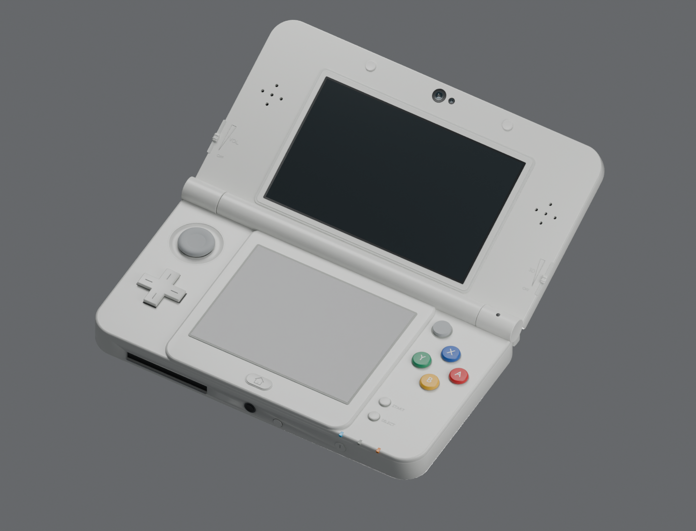
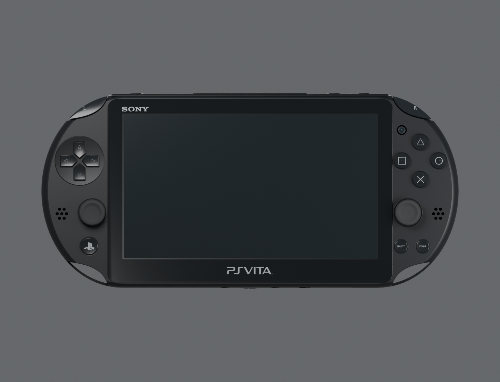
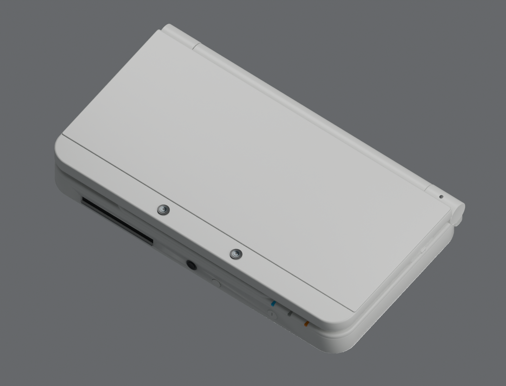
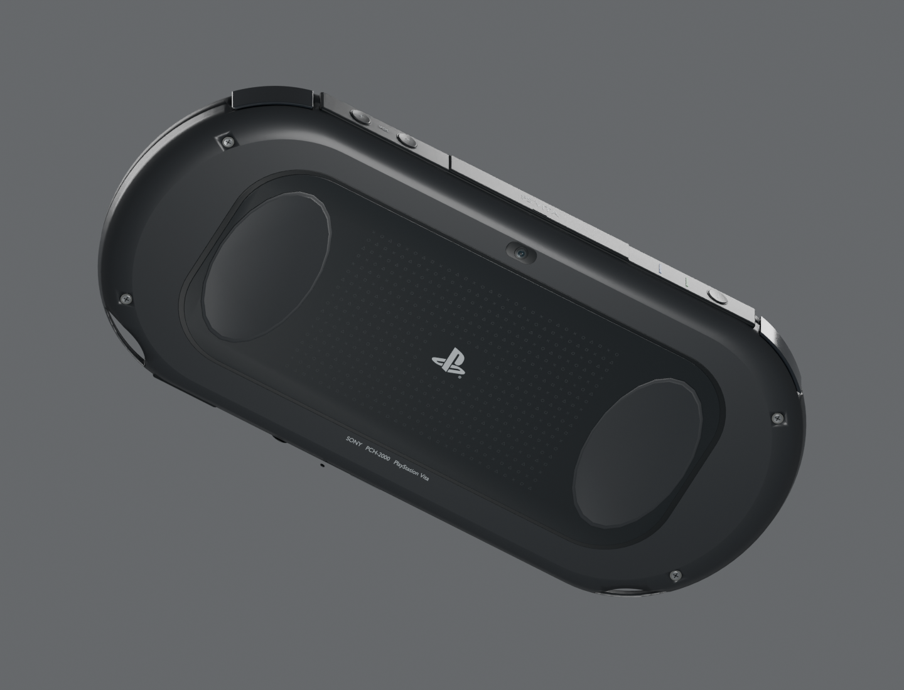
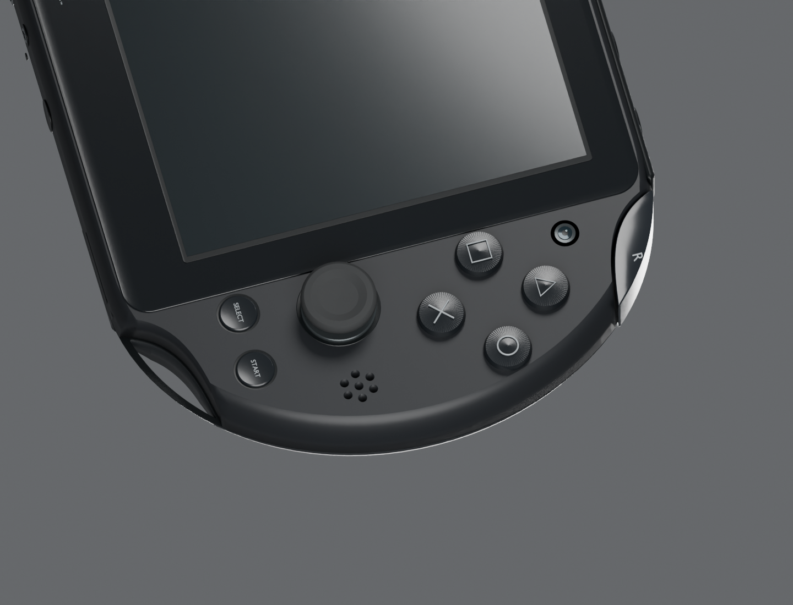

# Handheld model sources

`build.py` authors the white **KTR-001 New Nintendo 3DS, standard size**, and
black **PCH-2000 PS Vita** in Blender. Each asset directory contains its editable
`.blend`, web `.glb`, Stage profile, attribution and export receipt. The Blender
files include the individual named parts, materials, studio lights and camera.

```sh
/Applications/Blender.app/Contents/MacOS/Blender --background \
  --python tools/handheld-models/build.py -- all
```

Use `3ds` or `vita` to build one device; append `--no-render` to export the
assets without the inspection renders. Blender 5.1.2 was used for the checked
exports. The generator reads the committed vector contours without third-party
Python modules. Photos and dimensional sources are listed in `references.json`.
The dimensions come from the manufacturers; the small-feature placements and
material values are estimates from the photographs.

| New Nintendo 3DS | PS Vita 2000 |
| --- | --- |
|  |  |
|  |  |

The Vita front panel has concave reliefs at all four corners. The L/R buttons
sit in the upper chassis pockets and complete the outer curve below the front
lip. The lower reliefs open through the chassis and assembly seam, leaving the
curved strap bridges. The corner geometry follows the 4Gamer PCH-2000 teardown
close-ups in the reference manifest.



The 3DS `Lid_Hinge` empty owns the lid, display, speakers, cameras and sliders.
Its `Lid_OpenClose` clip runs closed at frame 1, open at 155 degrees at frames
40–60, and closed at frame 100. The native Blender X rotation is
`180 degrees - opening angle`. The browser exposes 0–175 degrees. The fixed
bottom screen retains its touch coordinates throughout the animation.

`dist/handheld-models/` receives front, rear, angled, closed and side renders.
The source scene stays editable; export batches static objects by material and
hinge parent. Displays keep separate materials and full-panel UVs. Fine rear
touch-panel markings are flat ink geometry, with no cylindrical sidewalls.

The homepage hero presents both devices beside the existing heading, with
PSPMAN first in the four-case strip. The Motion chapter retains its PSP.
The 3DS sits at upper left and Vita at lower right. The captions contain only
**Nintendo 3DS** and **PS Vita**. Drag the shell to rotate either device. The
3DS starts at 155° open; the Blender source retains its hinge animation.

The homepage loads the device packages as they approach the viewport. Each new
device owns an AppInstance iframe and WebAssembly instance. New 3DS runs the
existing `apps/3ds-demo` Contacts app at **400×240 plus 320×240**. Vita runs
`apps/motions` at **480×272 logical pixels, rasterized at 960×544**. Pointer hits
on the lower 3DS glass retain their auxiliary-surface identity. Buttons hold
until a guest tick has consumed the press; hidden previews stop their clocks.

```sh
bun run site:build
bun test tests/handheld-models.test.ts tests/site-stage.test.ts
bun site/preview.ts --no-build --port=4173
# In another terminal:
bun site/verify-handhelds.ts http://127.0.0.1:4173/
WIDTH=390 HEIGHT=1200 MOBILE=1 SHOT=dist/handheld-models/homepage-handhelds-mobile.png \
  bun site/verify-handhelds.ts http://127.0.0.1:4173/
# Check the homepage at 1440 and 390 CSS pixels; captures stay in ignored dist/:
bun site/verify-hero.ts http://127.0.0.1:4173/
```

The browser verifier checks contact selection, lower-screen scrolling, Vita
button raycasts and release, and records screenshots and JSON receipts under
the ignored `dist/handheld-models/` directory. Browser and Blender receipts cover the homepage models and demos;
they do not constitute physical-console deployment or acceptance.

[View the hinge animation](../../engine/pocket3d/examples/handheld/assets/new-nintendo-3ds/preview-hinge.gif).
Render it from the committed `.blend` file:

```sh
/Applications/Blender.app/Contents/MacOS/Blender --background \
  --python tools/handheld-models/render-animation.py
ffmpeg -y -framerate 6 -i dist/handheld-models/hinge-frames/%03d.png \
  -vf 'split[a][b];[a]palettegen=max_colors=128[p];[b][p]paletteuse' \
  -loop 0 dist/handheld-models/new-nintendo-3ds-hinge.gif
```

## Shells for a page

`shells.py` renders a device from the front for a page that shows its screens
in it: the Pocket3D player (`devices/web/pocket-web-wgpu/web/shells`) and the
MicroTS playground (`site/microts/shells`, which also shows the Pocket3D set's
PSP and 3DS). An orthographic camera on the screen's axis, a transparent film,
**14 pixels a millimetre** (20 for the iPod touch, 16 for the Android phone and
the playground's phones, 18 for the iPod nano). `bun tools/handheld-shells.ts`
runs it and encodes the result.

```sh
bun tools/handheld-shells.ts pocket3d              # all five: psp, vita, 3ds, ipod, android
bun tools/handheld-shells.ts pocket3d 3ds --samples 64
bun tools/handheld-shells.ts microts               # gba, iphone-4s, ipod-touch-5, bb-classic, ipod-nano
```

The playground's GBA, iPhone 4S, iPod touch and BlackBerry are **other
authors' models under CC BY 4.0, which this repository does not carry**.
`downloads.json` names each one (title, author, Sketchfab page, SHA-256).
The tool downloads a missing one into the ignored `dist/handheld-sources/`
with a Sketchfab token (`SKETCHFAB_TOKEN`, or the file `~/.sketchfab-token`;
Sketchfab gives a download only to an account) and refuses a file whose
SHA-256 differs. `site/microts/shells/ATTRIBUTION.md` credits them and lists
what was changed.

Each device is rendered as **the case with its moving parts taken out**, then
**each moving part alone** in its own rectangle of the frame, packed on one
sheet. A page lays the parts over the case and moves one when its key is
held. The profile says where the screens, the controls and the parts are, and
(`system`) the keys a device keeps for itself, such as a phone's home button.

- The PS Vita and the 3DS are read from their `.blend` files. The 3DS's
  hinge is set flat (`Lid_Hinge` at 0), so both screens face the camera.
- The PSP is Dibad's GLB, one mesh. The script finds the front from the
  screen's plane, brings the model to millimetres, and **splits it by where a
  face is**: a d-pad arm is a wedge about the d-pad's middle, a face button a
  disc about its cap, and only what stands in front of the case's face is a
  key. Sockets get dark floors, since the file has bright metal behind a key.
- The iPod nano is read from its `.blend` file (`ipod-nano-2/source`), turned
  from centimetres with its front toward -Y into millimetres facing the
  camera. Its menu, studio, lights and cameras are left out, its case is
  anodized pink and its LCD dark. The centre button is a part; the click
  wheel's ring is a place for a pointer (`zones`).
- The downloaded models are turned to the script's axes and brought to the
  device's size in millimetres (`glb`). A key that is pieces of one mesh is
  the pieces inside its rectangle, joined. A place that is only paint on a
  model's picture (the BlackBerry's screen and the row under it) is found
  through the face whose texture coordinates hold it. A maker's name or logo
  is taken out of the mesh or painted over in the picture; a screen's picture
  gives way to a dark panel.
- The iPod touch and the Android phone are drawn in the script, each lying
  on its side with its keys' end at the right: the player turns the picture
  a quarter for a screen that stands.
- **`hide` lists the objects that are a wordmark or a logo.** A new device
  lists its own before its shell is committed.

Cycles' noise differs between two runs, so a rerun changes the files' bytes.
