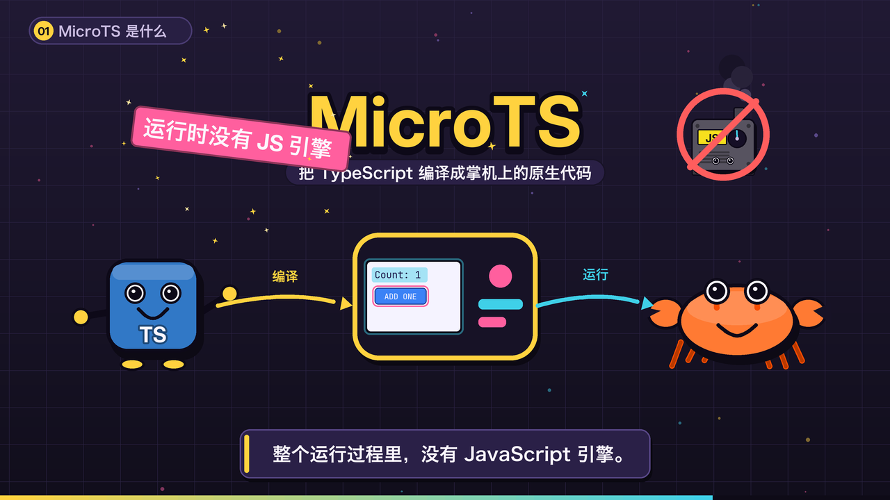

# MicroTS explainer video

A 2D cartoon explainer, in Chinese, about how MicroTS compiles TypeScript to
native code. **The frames are drawn with Pillow at 2x and downsampled on
export**, so a render needs no browser, no Blender and no `node_modules`.
Narration comes from the macOS `say` voices; the music, the ducking and the
mix are synthesized in `soundtrack.py`.



```sh
python3 tools/microts-explainer/render.py
```

The run writes to the ignored `dist/microts-explainer/` directory:
`microts-explainer.mp4` (1920x1080, 30 fps, H.264 + AAC), the mixed
`narration.wav`, the per-line voice cache in `voice/`, and `receipt.json` with
the duration, resolution, SHA-256 and every spoken line. Delete `voice/` to
re-record the narration; the cache key is the voice, rate and text.

| Flag | Effect |
| --- | --- |
| `--stills` | one PNG per scene into `dist/microts-explainer/stills/` |
| `--still-at 0.62` | fraction into each scene the stills are taken at |
| `--scene pipeline,trait` | render the named chapters only |
| `--no-audio` | estimate line lengths instead of calling `say` |
| `--voice Sandy --rate 300` | another `say` voice and words per minute |
| `--width 1280 --preset veryfast` | draft render |
| `--jobs 8` | frame workers; the default is CPU count minus four |

| File | Contents |
| --- | --- |
| `stagecraft.py` | canvas, brand palette, mixed CJK/Latin type, panels, code cards, captions |
| `cast.py` | the cast and props: the TS mascot, Ferris, the script engine, the handheld, the GBA, the counter and Hero screens |
| `storyboard.py` | ten chapters, each with its narration lines and draw function |
| `soundtrack.py` | narration cache, square-wave music, sidechain ducking, mix |
| `render.py` | timing plan, parallel frame render, ffmpeg mux, receipt |

**Every scene is timed from its own narration.** `plan()` measures each spoken
line, places it on the clock and hands the scene the resulting beats, so
`ctx.since(i)` is the time since line `i` started and a visual beat lands on the
sentence that describes it.

## What the video claims, and where it comes from

| Chapter | Claim | Source |
| --- | --- | --- |
| 01–02 | TypeScript compiles to native code that runs without a JavaScript engine | [microts.md](../../site/content/docs/microts.md) |
| 03 | A view and its basename model; `i32` maps to a Rust `i32`, `number` is rejected under `--strict` | [typescript-support.md](../../site/content/docs/typescript-support.md) |
| 04 | Type checker, View IR and Model IR, Rust printer, `gen/*.rs` and `styles.bin`, Cargo with `microts` | [microts-model.md](../../site/content/docs/microts-model.md), [STRUCTURE.md](../../docs/STRUCTURE.md) |
| 05 | The view-model trait; `compiled` generates the methods, `rust` leaves them to the application | [microts-boundaries.md](../../site/content/docs/microts-boundaries.md) |
| 06 | `frame(input)` dispatches input, updates changed bindings, then the core lays out and emits a DrawList | [microts.md](../../site/content/docs/microts.md) |
| 07 | The admitted subset, the `file:line:column` error and the absence of a fallback | [typescript-support.md](../../site/content/docs/typescript-support.md) |
| 08 | The differential test compares the JS run against the Rust run frame by frame | [tests/aot-differential.test.ts](../../tests/aot-differential.test.ts) |
| 09 | `apps/gba-hero` becomes a GBA ROM; about 11 FPS measured in mGBA against a 30 FPS target, hardware untested | [hosts/gba/README.md](../../hosts/gba/README.md) |

The Hero screen in chapter 09 redraws the layout of
[`apps/gba-hero/app.tsx`](../../apps/gba-hero/app.tsx) at 240x160.

## Requirements

macOS for `say`, `ffmpeg` on `PATH`, and Python 3 with Pillow. Latin and
monospace faces come from `assets/fonts/`. The CJK face is the first of
Hiragino Sans GB, STHeiti Medium or Arial Unicode that the system has;
`--no-audio` renders without narration on a machine with no `say`.
